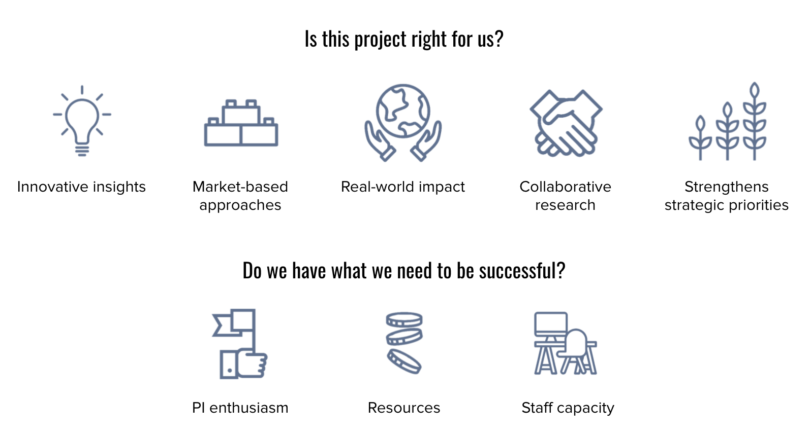

# Project selection and scoping

## Project selection criteria

emLab’s project development and selection criteria build on our mission and research identity to create guidelines for prioritizing the use of resources.

The criteria are designed as a flexible tool, not a simple checklist or formula. To take on a project, the Executive Director and at least one emLab Principal Investigator should be able to answer “yes” to the following questions: 

- Is this project right for us?
- Do we have what we need to be successful?

Below are criteria that, if met, would contribute to a “yes” answer for each of the two questions. The number of criteria that have to be met to arrive at a “yes” answer and the threshold for meeting those criteria will shift over time as the interests and priorities of emLab evolve. For example, building long-term priorities, such as a strategic relationship, may be particularly important at times and may lead emLab to take on projects that are less aligned with the core emLab identity or that present greater risks than might otherwise be acceptable. 

**Is this project right for us?**

These strategic criteria ask whether projects build emLab’s brand and advance its organizational priorities.

- *Aligned with emLab’s mission and research identity.* **A project must satisfy at least three of the four cornerstones of our research identity** (innovative insights, market-based approaches, real-world impact, and collaborative research). emLab projects have the potential to generate new insights and inform durable solutions that generate real-world impact. Projects are deeply innovative and focus on informing and developing sustainable, market-based approaches to pressing environmental issues. Projects have a clear path to real-world impact, often through co-development of research questions and priorities with external stakeholders, who can shape research questions and use research findings to drive change. 
- *Strengthens strategic priorities.* emLab projects should have a clear potential to strengthen priorities identified by emLab leadership and staff. This includes considerations such as the potential to bring in new datasets or models, strengthen new or existing relationships with partners and funders, or develop emLab’s intellectual capital on priority initiatives and tools. 

**Do we have what we need to be successful?**

Practical project selection criteria ask whether emLab has the internal capacities and external resources needed to deliver excellent work. In order of importance: 

- *PI enthusiasm.* Every emLab project is sponsored by an emLab Principal Investigator who is excited to develop, execute, and deliver the project. 
- *Adequately resourced.* When developing and scoping projects, PIs should ensure that the emLab team will have the funding and timeline needed to deliver the project. They can additionally make sure the team has access to the datasets and partnerships needed to deliver the project and facilitate successful implementation. 
- *Staff capacity.* emLab takes on new projects if (1) we have research staff with availability and required expertise or (2) we are confident we can recruit the expertise and capacity to fit the needs of the project. 

## Setting projects up for success in project scoping

As a project is scoped, the PI and emLab operations team should clearly define project objectives/research questions, scope, approach, timeline and capacity needs. Key considerations in this process include:

- Follow emLab project selection criteria to evaluate project fit (novel insights, uniquely qualified, strengthen strategic priorities) and capacity to deliver (PI enthusiasm and ownership, staff capacities and skill sets, adequately resourced), and identify potential risks
- Clarify and align on expectations with partners/sponsor on budget, SOW, methods and approaches, data needs, timelines, their objectives and end goals for the research, and how much flexibility there is around specific deliverables outlined in the SOW.
- Review any potential ethical or reputational concerns as outlined in section 5.3.2 of emLab’s standard operating manual.
- Identify the capacity needs and team composition including level of project management and communications support, project scientists, postdoctoral researchers, and graduate and undergraduate student researchers.