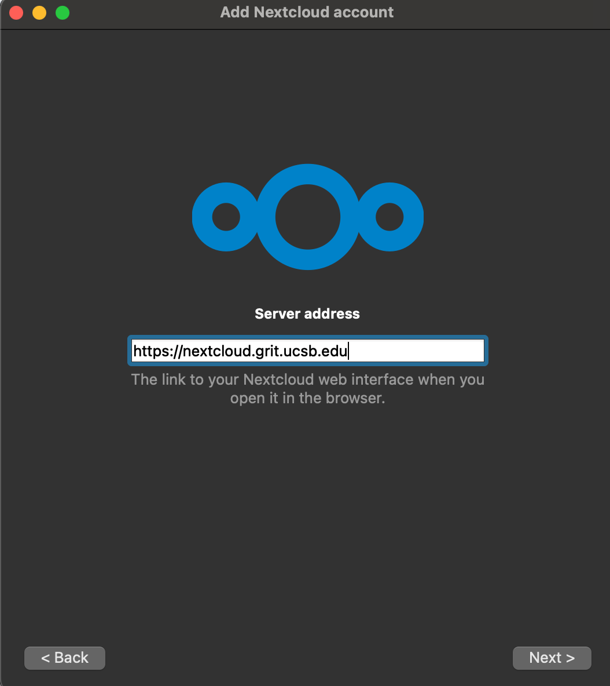
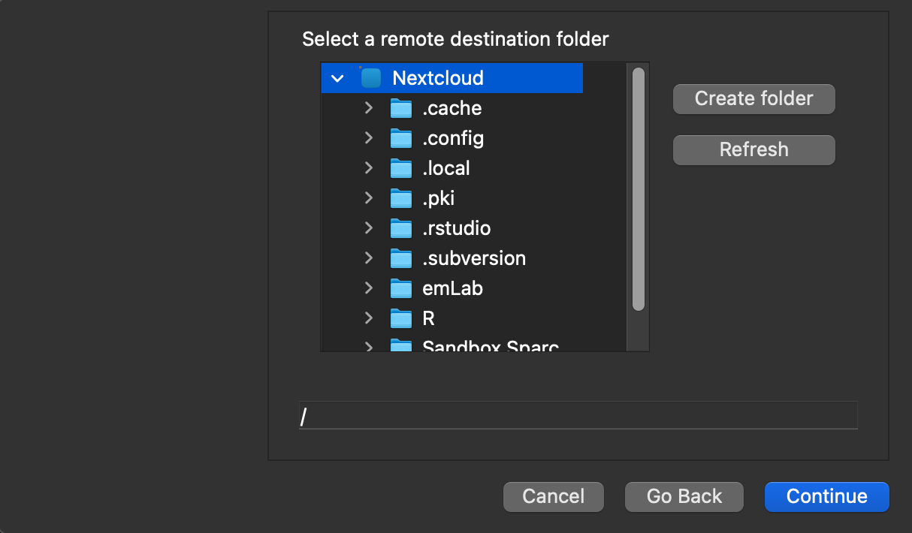
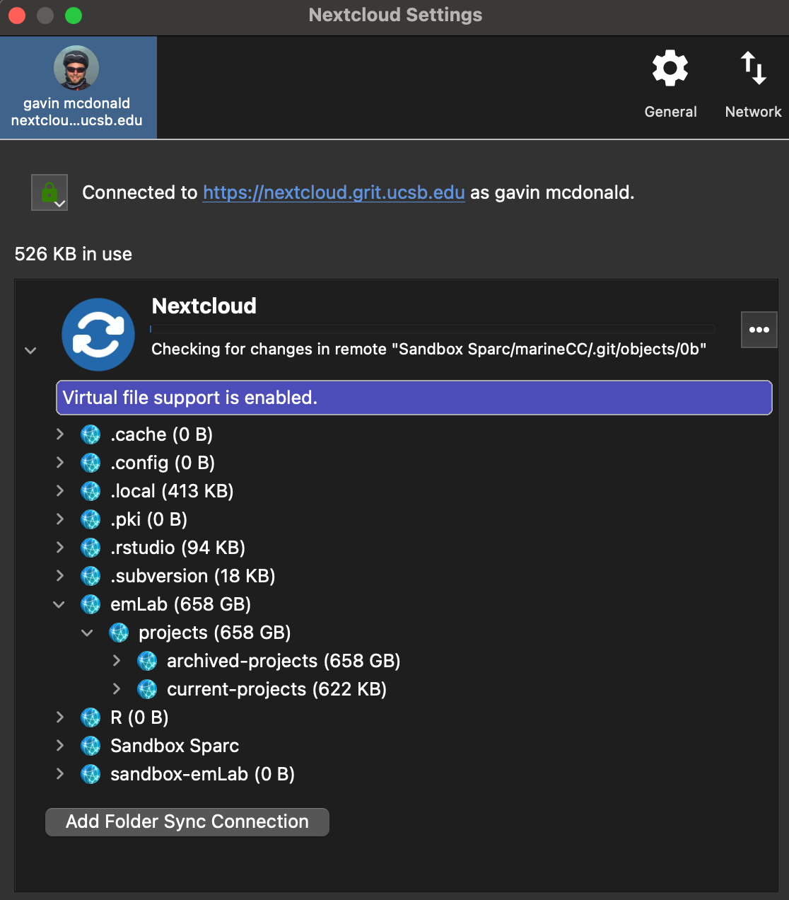
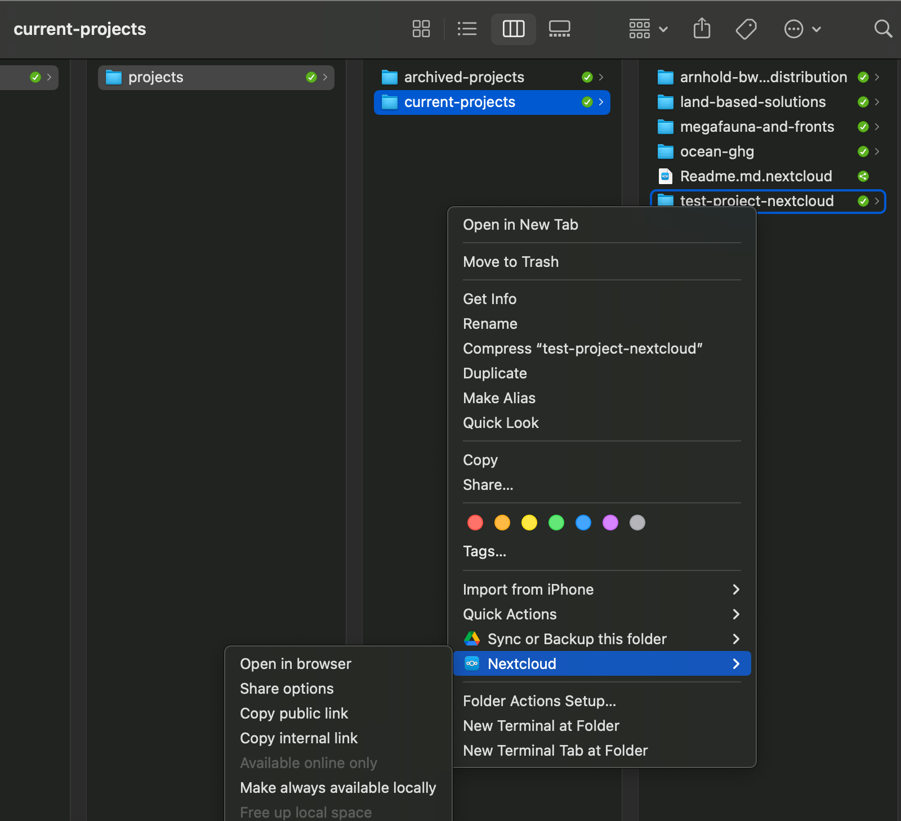

# emLab workflow and platforms

To support both organization and collaboration, a standardized, transparent, and version controlled workflow is central to our team. We rely on the Google Suite (e.g., Gmail, Google Drive, Google Calendar), Slack, and Zoom to centralize and facilitate internal and external communication, and GitHub, Zotero, Shared Drive, and Nextcloud/the emLab server to support our data science and other project-related work. The sections below detail how we use each of these platforms and how to set them up. We have separate documentation for our [data and code standard operating procedures](https://emlab-ucsb.github.io/SOP/index.html). 


## Email
Coming soon

## Calendar

Our team relies heavily on Google Calendar to check team members' availability and schedule meetings. Please keep your calendar up to date!

**Setting out of office notifications**

The best way to let people know if you are on vacation or out of the office is by setting up your calendar event as “Out of Office” instead of a regular event. You can customize this to automatically decline meetings on that day.

**Adding other calendars**

To view team member’s calendars, click on the plus symbol next to “Other calendars” on the left hand side of your calendar and select “Subscribe to calendar.” There is a full list of team emails in the [emLab Team Roster](https://docs.google.com/spreadsheets/d/1hjFkcU68e7AMs-ueEYR82idqi3-dMJk-p1VRd5_YZV8/edit#gid=0) document. 

**Scheduling rooms**

See [Chapter 13.1](https://emlab-ucsb.github.io/emlab-manual/housekeeping.html#conference-rooms) for information on reserving conference rooms.

## Zoom

Through UCSB, we have access to a paid Zoom account, which we use for all video conferencing. You can schedule a Zoom meeting (or recurring meetings) through your [browser](https://ucsb.zoom.us/) or the [Zoom app](https://zoom.us/download). Below are our Zoom best practices and guidelines. 

### Making scheduling easier

To make scheduling with Zoom easier, install [Zoom for GSuite](https://gsuite.google.com/marketplace/app/zoom_for_gsuite/364750910244). Once synced with your Zoom account, it will show up as an option along with Hangouts under conferencing when you create a calendar invite. Once created, you will also be able to see the meeting on your Zoom account.

{height="50%" width="50%"}

### Being an effective communicator on Zoom

Here are a couple of tips for getting the most out of virtual meetings:

- **Everyone on video:** it’s nice to see everyone’s face instead of talking to black boxes. If your internet isn’t acting up, turn your video on to have a more engaging conversation. 
- **Sharing screens:** to keep everyone on the same page, have the presenter share their screen so all of the participants are looking at the same information to avoid any possible confusion. This is a good way to troubleshoot code, walk through documents, etc.
    - The new Zoom default is to only allow the host to screen share. To allow all participants to share their screens, go to your settings and under “who can share?” select “all participants.” 
    - Note: If you aren’t comfortable changing this setting, instead turn on the ability to have co-hosts and in the meeting select the screen-sharers to be co-hosts.
- **Whiteboard:** Zoom has a whiteboard feature that allows you to draw on your screen for everyone to see. To use this feature, share your screen and select “whiteboard” instead of a browser window. 
- **Nonverbal communication:** use the reactions feature in the bottom bar of your zoom meeting to react during a meeting. You can also raise your hand in the meeting to signal that you have a question. To raise your hand, open the participant panel by clicking on participants in the lower bar and then click “raise hand” in the lower right hand corner (note: the host can’t raise their hand). 
- **Making the most of virtual meetings:**	
    - Circulate as much as possible (agenda, slides, google docs, etc.) before the meeting so people have time to read/review them 
    - If needed, schedule longer meetings to avoid feeling rushed and allow time to repeat things or deal with technical difficulties 
    - Notify people ASAP if they are cutting out
    - Dial-in and use phone for audio if your internet connection is poor 
    - Turn off videos if connection is poor

## Slack

Our team uses Slack on a daily basis to keep communication channels open within teams and across our different offices. We have an emLab workspace that houses all of our channels. When you are first added to Slack, you will be added to the general, random, communications, report and publications, and code channels. Feel free to browse and join other channels in our workspace. You will be added to project specific channels on an as needed basis. You can view Slack either through a broswer window or by [downloading the desktop app](https://slack.com/help/categories/360000049043-getting-started).

### Slack basics

Slack is organized into channels and direct messages. Channels are a way to organize conversations and other than a couple general emLab channels, are often project specific. Whatever you share in a channel is viewable by all members of that channel. You can also send direct messages to an individual or a group of up to 9 people. 

The status feature is helpful for letting others know if you are in a meeting or on vacation, and therefore may not be responding in a timely manner. 

One great thing about Slack is that it’s searchable. You can search either by person or keywords to find old messages. Additionally, if someone sends you something you will need to reference multiple times, you can save messages by clicking on the bookmark icon on the top right hand corner of the slack and view them by selecting “saved items” in the left menu bar on Slack. You can also mark messages as unread or be reminded about them later by clicking on the 3 vertical dots on a message and selecting “mark unread” or “remind me about this.”

People have differing notification preferences, which you can set under Preferences → Notifications. If someone sends you a direct message or tags you, a number will show up on your slack app. If they add something to a channel you are on but don’t tag you, a red dot will show up. To ensure someone gets a numbered notification, either tag them (i.e. @Erin) or tag the channel (i.e. @channel). Tagging the channel will send a notification to every member of that channel.

### Creating a channel

When a new project starts, create a slack channel for it and add the relevant team members to it. To create a channel, simply click on the plus symbol next to channels and fill out the channel information (Name, Purpose, and Send invites to). If you need to add any guests to a channel, slack Erin with the guest's email and the channel they need to be added to.

## Google Shared Drive

We have all experienced the moment where we can’t remember where a Google Doc is. To help solve this problem, we created an emLab Shared Google Drive, which is a centralized space for all of our Google-related documents to live within a shared file structure. Unlike files in My Drive (your personal Google Drive account), files within the Shared Drive belong to the team instead of an individual. So even if people leave, the files stay exactly where they are and aren’t lost with that person’s account. The structure of Shared Drive is detailed in Section 2. You can read more about Shared Drives [here](https://support.google.com/a/users/answer/9310351). 

***Please do your best to centralize all of your non-data project documents within the Shared Drive.*** 

### Shared Drive structure


The emLab Shared Drive is organized into three main folders:

- `central-emlab-resources`: includes meeting and event information, onboarding materials, information about travel reimbursements, and the team roster
- `communications`: includes the blog schedule, presentation templates, and publication and media tracking. Note: Adobe design projects, photo repository, and emLab logos live on the server. 
- `projects`: includes information on past and current projects, and project management guidelines

A full table of contents can be seen [here](https://docs.google.com/document/d/1a26a6N4akF2dSXWfp0fWxGegd0wvrPVUeaA09en2EPE/edit).

### Sharing files

There are multiple levels of access people can have to the Shared Drive: member level (i.e. has access to everything within the Shared Drive), folder level, and file level. Members of the Shared Drive can see all folders and files within the Drive. *If you want to send a quick link to someone who is part of the Shared Drive, simply copy the URL from your browser.* There is no need to create a shared link if you are sending it to someone with access to the emLab Shared Drive. 

Sharing files and folders with external people works the same as a regular Google Drive folder or file. Simply select “Share” and either add people’s emails or create a shared link.

### Shared Drive permissions

All full time staff (PIs, postdocs, project researchers, ops) will be added as members of the Shared Drive. Students and collaborators will be added at the folder level for those projects they are engaged in. They can either be directly added to the folder or given a shareable link for access. *Note: some institutions are Outlook based and there may be restrictions in adding their university emails to Shared Drive.* 

### Linking the Shared Drive and your Computer

#### Why install Drive for Desktop?

As explained above, using a Shared Drive means that individuals don’t “own” the files. All files are instead owned by the emLab Shared Drive, which lives “on the cloud.” You can access these files through a web browser, just as you would access them on Google Drive. However, it is nice to have the files directly in your computer. To do so, you’ll need to [install Drive for Desktop](https://support.google.com/a/answer/7491144?hl=en), Google’s new system that will partially replace Google Backup and Sync.

There are important distinctions between Backup and Sync and Drive for Desktop (previously referred to as Drive File Stream). As the names indicate, Backup and Sync syncs and stores Drive content locally on your computer (that is, it takes up space in your hard drive). Drive for Desktop, however, streams all files and folders from the cloud. You can think of these as owning a DVD vs. streaming the movie from Netflix. You can read more on the differences between these approaches [here](https://support.google.com/drive/answer/7638428?hl=en&ref_topic=6069785).

#### Step-by-step installation

**Step 1:** go to [Get started with Drive File Stream](https://support.google.com/drive/answer/7329379) and select the appropriate installer for your operating system. *Note: Make sure you are on your UCSB google account when installing.*

**Step 2:** follow the instructions on the install window (you can accept all defaults).

**Step 3:** once the installation is complete, you'll need to sign in to your account. To do so:

- Click on the Drive File Stream icon ()
    - On Windows machines, it should be on the bottom right corner of your screen
    - On MacOS, it should be at the top right of your screen
- Sign in with your UCSB account, click through the application overview slides, and finally click on the button to open your Google Drive folder. 

Once that finder / explorer opens, you should be able to see two folders: 1) My Drive and 2) Shared drives. The first folder will contain files owned by you (that is, your normal Google Drive Files stored on your UCSB account). The second folder will contain all shared drives you are part of. By navigating to that folder, you should see the emLab shared drive, containing all the folders mentioned earlier. 

### Other considerations

#### *Actual* location of the Google Drive folder on my computer

Remember that Drive for Desktop will stream, not save files to your computer. Therefore, there will be no folder directly under your devices / hard drives. Instead, your computer will detect the Google Drive folder as if it were an external device connected to your machine. On a Mac, the folder will therefore appear on your desktop, or under the `Devices` tab of your Finder. On a Windows machine, it will appear under `This PC`, next to your hard drive and any other connected devices.


#### I also want to link a personal gmail account

The easiest way to do this is to share the folders from your personal drive that you want access to with your @ucsb.edu email. This avoids the hassle and potential issues that arise by also installing Backup and Sync. 

## Nextcloud and the emLab server

Everything that is not Google docs/sheets/slides lives on the emLab server, which is managed by GRIT. This includes data files, PDFs, photos, videos, etc. The emLab server can be accessed via a platform called Nextcloud, which is very similar to GoogleDrive where there is a browser option and a desktop app.

Below are instructions for signing up for a GRIT account and setting up Nextcloud on your local machine.

### Signing up for an account with GRIT

**If you do not yet have a GRIT account**

1. Fill out the GRIT compute access request form (CARF): [https://forms.gle/kqzttgMAjzt867FZA](https://forms.gle/kqzttgMAjzt867FZA)
    - Under “Faculty” put: Christopher Costello
    - Under “Research Group Name” put: emLab
    - Under “GRIT Server or Service that the person will need access to?” put: **emLab group membership (for accessing emLab data storage space and emLab computational servers, including quebracho and sequoia) and Nextcloud group membership.**
    - Note: If you are a member of the Waitt team in addition to the above add: emLab Waitt group membership

2. You should receive an email from GRIT saying that your account has been created. Follow any additional instructions provided by GRIT.

3. Create your GRIT access credentials at the following link: [https://dc1.grit.ucsb.edu/](https://dc1.grit.ucsb.edu/). The username and password you use here will be the same username and password for accessing the Nextcloud data directories and emLab servers.

**If you already have a GRIT account but are not connected to the emLab group**

1. Send a help ticket email to GRIT (help@grit.ucsb.edu). Say that you are part of the emLab research group, which has Christopher Costello as the faculty PI. Ask them to please connect the email to the emLab group membership (for accessing emLab data storage space and emLab computational servers, including quebracho and sequoia) and Nextcloud group membership. Follow any additional instructions provided by GRIT.

2. Create your GRIT access credentials at the following link: [https://dc1.grit.ucsb.edu/](https://dc1.grit.ucsb.edu/). The username and password you use here will be the same username and password for accessing the Nextcloud data directories and emLab servers.

**If you ever need to reset your password,** you can use the following link: [https://selfservice.grit.ucsb.edu/](https://selfservice.grit.ucsb.edu/).

### Setting up Nextcloud on your local machine

Installation steps for Mac and Linux (note that after Step 2, we only provide screenshots for Mac, but that the Linux experience should look very similar).

#### Downloading the Nextcloud desktop app and connecting it to GRIT

**Step 1:** Download and install the [Nextcloud Desktop app](https://nextcloud.com/install/).
- Linux users: Nextcloud Desktop client packages are also available via the package manager directly for many Linux distributions. Ubuntu and derivative users can get the latest stable release by adding the PPA and then installing via the Software Manager.

**Step 2:** Open the app and click “Log in”


**Step 3:** When prompted, enter https://nextcloud.grit.ucsb.edu as the server address.



**Step 4**: Sign in with your GRIT credentials (created in the section above). It will have you sign in through your browser to grant the Nextcloud desktop app the necessary permissions. Follow the prompts in your browser.

#### Configuring how the Nextcloud desktop app will sync or stream files to your local machine

There are generally three approaches for syncing and streaming files to your local machine using the Nextcloud desktop app. We will provide instructions for each of these 3 approaches so that individuals can choose what works best for them. Generally though, we recommend option #3.

**Option 1: “Stream” the entire emLab directory using virtual files.**

- Pros
    - Virtual files operate similarly to “streaming” using the Google Drive app. Virtual files take up very little hard drive space on your local machine, and are rather just a pointer to the actual file, which is stored on GRIT.
    - You will be able to view the full emLab directory structure on your local machine. The entire contents of the emLab directory will always be available and up-to-date.
    - If you do not wish to see the *entire* emLab directory on your local machine, you have the option selectively choose to ignore particular directories. For example, you may not need to see `projects/archived-projects` on your local machine (besides, you can always see it on the [Nextcloud browser interface](https://nextcloud.grit.ucsb.edu/index.php/apps/files)! )

    
- Cons
    - Virtual files have a .nextcloud extension, since they are just a pointer file. This means for instance that they cannot be directly read into R. To open a virtual file on your local machine, you need to first double-click on it (or right-click on it and say “Make always available locally”). Once you’ve done this, the virtual file is now available on your local machine, but it also now takes up hard drive space.
    - Since the entire emLab directory has hundreds of thousands of files across hundreds of directories, it will take some time for the Nextcloud desktop app to sync all of these virtual files. This process will take a long time when you first connect to the emLab directory (up to several days). However, once the initial sync of virtual files is complete, this should not need to occur again, and only new/modified virtual files will need to be synced.
    - Virtual files are not available offline without internet access.
    
**Option 2: Selectively “sync” only a subset of directories.** Using this approach, each individual manually selects which directories they want to sync to their local machine. For example, you may choose to only sync the project directories you are actively working with. The emLab Nextcloud directory is very large (multiple TB), so you do not want to do a full sync of the entire emLab directory on your local machine. 

- Pros
    - You will only see the most relevant directories on your local machine.
    - You have complete control over what gets synced onto your local machine.
    - Since files exist on your local machine, you will be able to read/write data exactly as you would with a regular directory on your computer. For example, interacting with data in R would work exactly like it does in other directories on your machine.
    - Synced directories will be available offline without internet access.
- Cons
    - Synced directories will take up space on your local machine. Since many of our directories are quite large, you will need to ensure you have sufficient hard drive space to sync the directories you want.
    - You will not be able to view the full emLab directory structure on your local machine. However, you can always view the entire directory structure using the Nextcloud browser interface: [https://nextcloud.grit.ucsb.edu/index.php/apps/files](https://nextcloud.grit.ucsb.edu/index.php/apps/files)
    - Whenever you join projects or leave projects, you will need to manually selectively sync directories onto your local machine as needed. So this will require some level of continual effort to ensure the right directories and files are synced.

**Option 3: “Stream” the entire emLab directory using virtual files, while also syncing a subset of the most relevant directories to be available locally.** We imagine that for most people, this will combine the most important pros and avoid the most painful cons from the above two approaches. Additionally, since many researchers will be performing computation on one of the emLab servers, it may be less necessary to sync data files onto your local machine.

##### File option 1: Streaming entire emLab directory using virtual files

**Step 1:** After logging in, you will be brought back to the Nextcloud app. Click “Skip folders configuration”. We will set up the necessary connections in a minute. This is important! The emLab Nextcloud directory is very large (multiple TB), so you do not want to do a full sync of the entire directory on your local machine. 


**Step 2:** Before continuing, you now need to to set up virtual file support for your local machine, follow these instructions, which vary by system.

Mac: navigate to the folder **~/Library/Preferences/Nextcloud**. You can do this through the Finder, but a faster way to do this is as follows:

- Copy and paste this directory path.
- Open the Spotlight Search, either by pressing command-space or by clicking on the magnifying glass in the upper right-hand corner of your screen.
- Paste the directory path into the box, then double-click “Nextcloud” to navigate to the directory.


    
- Right-click on the file nextcloud.cfg, click “Open with”, then click “TextEdit”. This will now open the configuration file which you will need to edit.


- Add the following line under the [General] header: **showExperimentalOptions=true** (you can simply copy and paste the text into the document, like a regular text editor)


- Finally, save the document (File -> Save), and quit (TextEdit -> Quit TextEdit).

Linux

- Navigate to the directory **~home/your_username/.config/Nextcloud** (where your your_username is your individual personal user name)
- Open the file **nextcloud.cfg** with a text editor
- Add the following line under the [General] header: **showExperimentalOptions=true**
- Save the file and quit your text editor

**Step 3:** Go back to the Nextcloud app. Click on your name in the app in the upper-right-hand (upper-left for Linux) corner of your desktop, click on your name, and then click Settings.

**Step 4:** Click “Add folder sync connection”


**Step 5:** If you use a Mac, enter **/Users/Shared/nextcloud** as the folder. This will ensure that the path is the same across most users, and thus all code should work across emLab users. Linux users do not have access to a **Shared** directory, so will need to use a different path such as **/home/your_username/Nextcloud**, where **your_username** is your Linux system user name. Click continue. 


**Step 6:** When prompted to select the remote destination folder, select the highest level directory called **Nextcloud**. The path name should simply show a forward slash, /. Click continue.



**Step 7**: Enable the checkbox option “Use virtual files instead of downloading content immediately (experimental)”. This is important! The emLab Nextcloud directory is very large (multiple TB), so you do not want to do a full sync of the entire directory on your local machine. Virtual files are Nextcloud’s equivalent to the Google Drive concept of streaming. You will be able to see files and directory structures on your local machine, but the files will not take up space on your local machine. Click “Add Sync Connection”, and click that you acknowledge this feature is experimental.


**Step 8:** Everything should now be set up correctly! When you navigate to settings now, you should see something like this. Note that it says “Virtual file support is enabled”.


**Step 9:** If you are using virtual files and streaming the entire emLab directory, you may wish to ignore particular directories. To do so:

- Open up the Nextcloud desktop app settings, click the 3 dots, and click "Edit Ignored Files"


- Click "Add" and then enter the new ignore pattern. For example, enter the pattern `projects/archived-projects/*` to ignore all files in the `projects/archived-projects` directory. If you also wish to hide the directory name itself, add a second pattern that is simply `projects/archived-projects`. This directory will no longer appear on your local machine.


- If at any point in the future you wish to see these directories again on your local machine, you can simply remove the ignore pattern from this list.

**Important Note!** We are currently in an active data migration process moving from Google Shared Drive to GRIT. We are "staging" files in a directory called `emLab/staging`. We *highly* recommend that you add `emLab/staging` and `emLab/staging*` to your ignored file lists. This will ensure that this staging directory cannot be seen or modified on your local machine. Once the migration process is complete, we will be moving all directories into their appropriate locations under the main `emLab` directory and will delete the staging directory.

##### File option 2: Syncing a subset of directories

**Step 1:** After logging in, you will be brought back to the Nextcloud app. Click “Choose what to sync”. This will bring you to a screen that contains all emLab directories. You may now select the subset of directories you wish to sync. Click “Add Sync Connection” after you have selected the appropriate directories.



**Step 2:** After completing the setup process, you can always add more directories to sync later on, or can always remove synced directories. To add new directories you want to sync: in the Nextcloud app, simply right-click on the directory you want to sync locally, click “Availability”, and click “Make always available locally”. To remove synced directories, you can instead click “Free up local space”.


##### File option 3: Streaming entire emLab directory using virtual files, and syncing a subset of directories

**Step 1:** First, follow the instructions above for streaming the entire emLab directory using virtual files (option 1).

**Step 2:** Next, sync the directories you want to be made available locally. By default, all directories and files will be virtual. However, you may wish to have some directories stored locally on your computer, for example to ensure that you can access them when you are offline. You can enable this on a case-by-case basis for specific directories. Just note that some directories are very large, and by doing this, the files in that directory will take up space on your local computer. As an example, here’s how to do this for the **test-project-nextcloud** directory. In the Nextcloud app, simply right-click on the directory you want to sync locally, click “Availability”, and click “Make always available locally”:


Alternatively, you can also do this on a Mac in your finder. Navigate to the directory you want to sync, right click on it, click “Nextcloud” and then click “Make always available locally”.


If you just want to sync a single file, you can also download virtual files, which have **.nextcloud** on the end of the filename, from your normal file finder by double clicking on them. They should then automatically download and open in the default app for that file type. Note that when you do this, the **.nextcloud** extension will disappear, and only the regular file extension will remain. This will also make these files available offline.



#### Making sure everything worked

You should also now be able to see the Nextcloud directory in your finder. Note that this will take some time to populate as the virtual files are set up. On a Mac, you should be able to navigate to Nextcloud on your finder directly. You can always simply navigate to the directory as well, **/Users/Shared/nextcloud**.


## Git and GitHub

Since most of our projects at emLab involve code, we use Git to track changes made to our code and facilitate collaboration by merging changes made by others, and GitHub to organize, share, and backup our code.

This section provides a brief overview of how Git and GitHub work, how to install them on your computer (and how to join the emLab GitHub page), and some general guidelines for how to use GitHub to organize code associated with emLab projects.

### What are Git and GitHub? 

Git is an open-source version control system designed for programmers. Git can operate as a standalone program on your computer, but can also be operated through many other programs (or “clients”). GitHub (really github.com) is a hosting service that provides online storage for your Git-projects. Think of Git as a little creature that keeps a record of all of the changes made to a file stored on your computer, and GitHub as a safe place on the internet that the little creature can go and put a copy of that file (and the changes you’ve made) when you tell it to do so.

There are a number of good tutorials with more information on how Git and GitHub work (as well as how you can set them up to sync directly through other programs such as RStudio). The [Ocean Health Index team at the National Center for Ecological Analysis and Synthesis (NCEAS)](https://www.nceas.ucsb.edu/ocean-health-index) here in Santa Barbara created a very detailed [data science training](http://ohi-science.org/data-science-training/) that includes two excellent tutorials on setting up and collaborating with GitHub:

- [GitHub](http://ohi-science.org/data-science-training/github.html)
- [Collaborating with GitHub](http://ohi-science.org/data-science-training/collaborating.html)

If you're new to using Git and GitHub, the two tutorials listed above are a great place to start since NCEAS and emLab often operate in a similar way. Additionally, see the Software Carpentry's lesson for the [Git novice](http://swcarpentry.github.io/git-novice/). If you primarily use (or will use) R for coding, Jenny Bryan also has an **excellent** tutorial specifically about how to integrate Git and GitHub with R: [Happy Git and GitHub for the useR](https://happygitwithr.com/)

If you're interested in learning more about all of the functionality GitHub has to offer, the [Openscapes team at NCEAS](https://www.openscapes.org/) has also tutorials on how to use GitHub for publishing code and for project management:

- [GitHub for Publishing](https://openscapes.github.io/series/github-pub.html)
- [GitHub for Project Management](https://openscapes.github.io/series/github-issues.html)

### Helpful terminology

Git and GitHub use some weird terms that might be unfamiliar. Before installing and setting up Git and GitHub, here are a few key terms you may come across: 

- repository ("repo"): a collection of files pertaining to the same project, document, goal, etc. Generally there's a single repository for each project at emLab containing all of the code associated with that project. This repository can be organized with multiple folders and subfolders.  
- commit: a set of changes made by a user to one or more files in a repository that the user wants to prepare to send to GitHub.
- push: the action of sending a commit from your local machine to the remote GitHub directory. 
- pull: the action of retrieving any commits that have been made to the repository and are stored in the remote GitHub directory but are NOT on your local machine.

### How to install Git and GitHub

Most of tutorials listed above include detailed instructions on how to install Git and GitHub. The short version (and steps specific to getting incorporated with the emLab GitHub page) are listed below. For more detailed instructions, please refer to the tutorials listed above. 

**Step 1: Create a free [GitHub](https://github.com/) account**

- Notes:
    - use your @ucsb.edu email
    - make sure you remember your **username** and **password**, you'll need this later

Since GitHub is a company, and is used by many different types of organizations in many different industries, they offer a few different pricing schemes/deals. As an individual, once you create a username and sign up for an account, you get an unlimited number of free public and private repositories, but the number of external collaborators allowed in private repositories is limited to three. GitHub also offers a "Pro" plan for $7/month giving you  unlimited external collaborators on all of your private repositories. However, for students, faculty, and research staff, or official nonprofit organizations and charities GitHub waives this fee through its [GitHub Education](https://education.github.com/) and [GitHub for Good](https://github.com/nonprofit) programs. 

Good news! emLab qualifies as an educational organization through the GitHub Education program, and as a UCSB staff member you qualify for the individual educational discount. So, once you've signed up for a free account on GitHub... 

**Step 2: Register as a researcher**

Go to the [GitHub Education](https://education.github.com/) page and register as a researcher *Note: this is why you should use your @ucsb.edu email for step 1.*

 

Click on the "Get benefits" link in the top right-hand corner and follow the directions to upgrade your account to a "Pro" account for free. You may need to take a picture of your UCSB ID card to submit as part of this process. GitHub may also periodically ask you to re-verify your eligability to qualify for this program. 

**Step 3: Get invited to the emLab GitHub organization**

Send Erin O'Reilly a Slack message (or an email if you must... eoreilly@ucsb.edu) with your new GitHub username so you can be added to the emLab GitHub page!

 

The emLab GitHub page is where the repositories for all emLab projects live (more on this later), and once you are a member of the organization you will be able to create new public and private repositories that appear here (as well as on your personal page). 

**Step 4: Install Git**

If you're very very lucky, Git will already be installed on your computer. Open the shell for your opperating system. If you're using Mac OS X, this is called Terminal. If you're using Windows, you have multiple types of shells, but you should be using a **Git Bash** shell (NOT Power Shell). The easiest way to find out whether Git is already installed on your machine is to type the following: 

```{bash, eval = F}
git --version
## git version 2.20.1 (Apple Git-117)
```

If it returns a version number, you already have Git installed! However, if it returns something like `git: command not found`, you need to install Git. 

There are a number of different ways to install Git. Stand-alone installers exist for [Mac OS X](https://sourceforge.net/projects/git-osx-installer/files/) and [Windows](https://gitforwindows.org/). If you're using Linux, you probably already know how to install Git.  

If you're using Mac OS X, Git can also be installed as part of the XCode Command Line tools, or you can also install it using Homebrew. If you're interested in either of those options, follow the cooresponding directions in Jenny Bryan's tutorial. If that sentence doesn't mean anything to you, download the installer from the link above and follow the prompts.

Once you've installed Git via whichever method you've chosen for your operating system, open the shell again and retype the same command to verify that the installation was successful: 

```{bash, eval = F}
git --version
## git version 2.20.1 (Apple Git-117)
```

It should now return a version number.

**Step 5: Tell Git who you are**

Git needs to know a little bit more about you in order to play nicely. In particular there are two things that it's helpful to configure: 1) The name that will be associated with any commits you make, and 2) the email address asssociated with your GitHub account. To set these two things, type the following into the shell using your name and email: 

```{bash, eval = F}
git config --global user.name 'Jane Doe'
git config --global user.email 'jane@example.com'
```

The user name input here should be your full name (i.e. it **does not** need to be the same as your username for GitHub), but the email **DOES** need to be the same as that associated with your GitHub account. 

You can then check to make sure these were entered correctly by typing: 

```{bash, eval = F}
git config --global --list
```

**Step 6 (optional): Store your credentials (so you don't have to type your password every time)**

Git will sometimes want to make sure you are you when performing certain operations. For example, when cloning a private repo or when you want to push changes to a repo. If you don't want to do this every time, you can tell Git to remember your password too. You can read more about Git's credential management [here](https://Git-scm.com/docs/gitcredentials).

On your terminal, navigate to a repository on your computer. (You can also use the Terminal pane within RStudio) and type the following into the shell:

```{bash, eval = F}
# Tell git to use the credential.helper
git config --global credential.helper store 
# git pull (or git push) will prompt you to enter your password
git pull
```

What we just did was to tell Git to store our credentials. So, after typing them this one time, you should not need to type it again.

**Step 7 (optional): Install a client for Git to make your life easier**

If you actually tried step 6 and you're still reading this, you probably don't usually spend a lot of time running commands in the shell and the last step didn't make a lot of sense. If that's the case, you might want to also install a Git client in order to help you visualize what Git is actually doing. You do not need a Git client to take advantage of version-control functionality of Git, as everything can be done using the shell (as in the previous step). However, the shell is not user-friendly. 

There are a number of Git/GitHub clients that you can download to interact with Git and GitHub in a more visual way. 

If you use RStudio, there is a very basic Git client built in that may be enough to get you started (more on this later). Other nice free Git clients include:

- [GitKraken](https://www.gitkraken.com/) (available for all platforms, plus the logo octopus is pretty sweet...)
- [GitFiend](https://gitfiend.com/) (cross-platform)
- [SourceTree](https://www.sourcetreeapp.com/) (has some problems on Mac OS X)
- [GitHub Desktop](https://desktop.github.com/) (not available for Linux)
- [GitUp](https://gitup.co/) (only for Mac OS X)

There are many more. See Jenny Bryan's tutorial if you're not satisfied with those choices. 

Once you've installed a Git client, follow the directions to connect to your GitHub account. Once you've done this, try opening the local version of the repository you made in step 6, and notice the nice visual representation of the changes you made.

### General guidelines for using GitHub at emLab

In general, each emLab project should have its own repository. There may be some cases in which multiple repositories may be associated with the same project, but this should be avoided if possible. The project repository should be created within the emLab GitHub page (exceptions may exist for example if a partner organization requires that the project repository be created within their organization’s GitHub page).

Repositories can be made public or private when they are created (depending on the nature of the project) while the project is ongoing, but should be made public when the project is complete.

Since many previous (and ongoing) projects were created within the personal GitHub pages of emLab members, the ownership of these repositories should be transferred to the emLab GitHub page at the conclusion of the project if possible.

In order to ensure that the relevant researchers are notified of issues and other activities, researchers should “watch” or “subscribe” to repositories in which they work.

## Zotero

emLab uses Zotero to collaboratively collect, organize, and cite publications. We organize publications into Group Libraries which can be at the project or paper level. Our account – `emlab-ucsb` – has unlimited storage and there is no limit to the number of people you can add to a library. In Zotero, storage for a library only counts against the owner, so **the emLab account must be the owner of the library for access to unlimited storage.**

### Making emLab the owner of a library

If creating a new group library, slack/email Erin (eoreilly@ucsb.edu) and she can directly create the library under the emLab account. 

If you are the owner of an existing library and would like to transfer ownership to emLab, first invite `emlab-ucsb` to be a member of the library. Once that invitation has been accepted, then go to "Group Settings" for the library and in the bottom right of the page, select transfer ownership to the emLab account.

### Saving publications to a library

To use Zotero properly, you need to install the Zotero Connector for your browser in addition to the Zotero desktop app (see [this page for downloads](https://www.zotero.org/download/)). 

The most convenient way to save publications to Zotero is through Zotero Connector. The Zotero Connector allows you to add publications from your browser to Zotero with a single click. The “save” button shows up in the upper right corner of your browser and the symbol appears  differently depending on the type of reference you are viewing (e.g. book, PDF, webpage). After you click the save button, a popup will appear that allows you to select the library to save the reference to. Read more about saving items to Zotero [here](https://www.zotero.org/support/adding_items_to_zotero). 


### Zotero integration with GoogleDocs and Word

Zotero is a great resource for adding references to a manuscript. It is integrated into both [Word](https://www.zotero.org/support/word_processor_plugin_usage) and [GoogleDocs](https://www.zotero.org/support/google_docs) for easy use. As a note, you have to take extra steps to ensure that your references remain linked when switching between Word and GoogleDocs. See [this document](https://www.zotero.org/support/kb/moving_documents_between_word_processors) for more information about moving documents with Zotero citations between word processors.

#### Adding a citation to your document

In both Word and GoogleDocs, Zotero shows up as a separate tab/menu item for you to choose from. For example, this is the Zotero tab in Word.


To add an in-text citation, place your cursor after the statement you want to reference and then click on “Add/Edit Citation.” This brings up a Zotero search bar that allows you to search for a reference within your libraries based on a keyword or author. As you type, Zotero brings up options that you can select from. 


Once you select the citation, either insert a comma to add another citation or select enter to add the reference. 

Note: If you are adding a citation for the first time to a document, you will be asked to select the citation style. This allows you to add a reference style based on your target journal.


#### Adding a bibliography to your document

The most amazing thing about Zotero is that it automatically generates a bibliography for you based on your in-text citations. To add a bibliography, simply place your cursor where you want to add your reference list and select “Add/Edit Bibliography.” It will add all of the references for you based on the citation style selected. 

## Project management platforms

There are many available cloud-based project management tools and platforms to help facilitate project management and track milestones and deliverables. It is up to each project manager and team to select a system that works best for their individual project and the team. See project execution section for more details and emLab templates for work planning. 

## Data and code standard operating procedure

Since we love GitHub and open data science, we have a whole Bookdown dedicated to [data and code standard operating procedures](https://emlab-ucsb.github.io/SOP/index.html) for emLab. In this document, you will find information about data storage, metadata, tidy data, code style guides, code reproducibility, high performance computing, and more. This is a living document, so please feel free to suggest updates in the `data-streamlining` slack channel. 