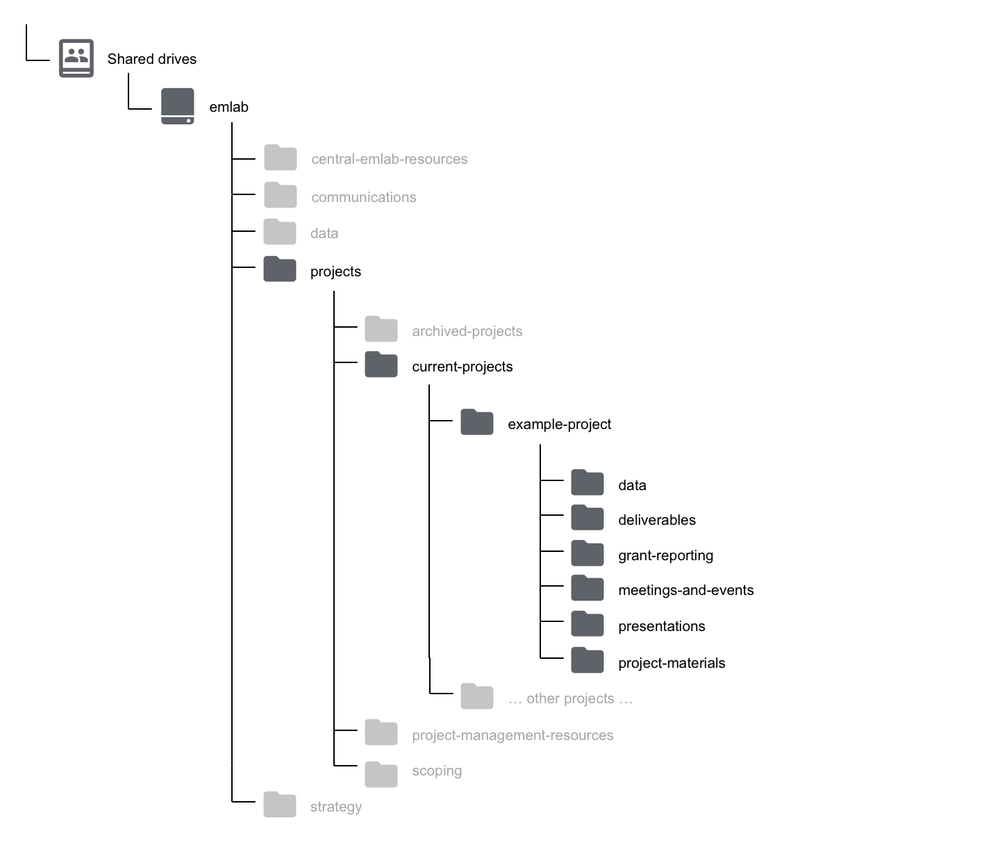
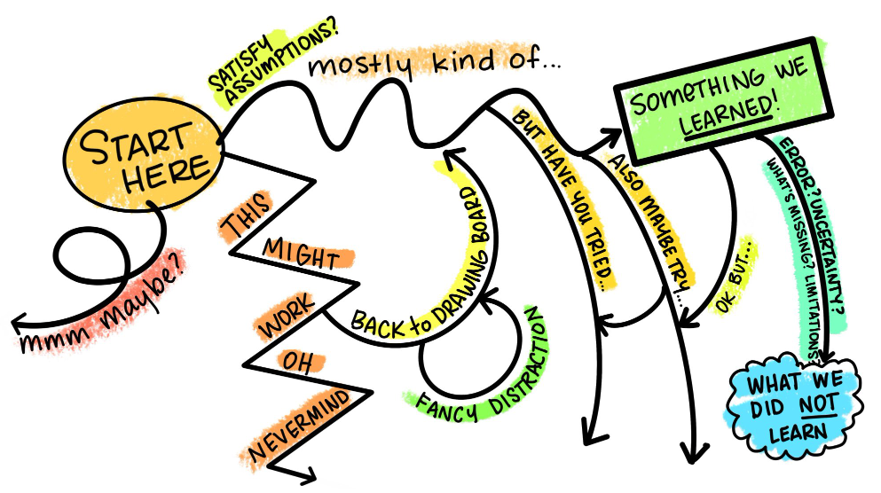
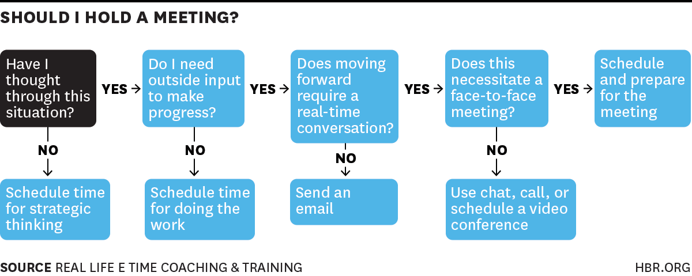

# Project management 

## Setting a project up for success

Yay we have a new emLab project! But now what? To set a solid foundation for a project, the following meetings and activities are required.

### Kickoff meetings

**Operations team handoff meeting**

Before a project kicks off, Michaela and/or Amanda will meet with the project manager to give them an overview of how this project was conceptualized, what deliverables are included in the scope of work, how flexible or rigid the timeline and deliverables are, the envisioned project team composition or plans for recruiting and hiring, and any other relevant details about the funder, project team, partner, or body of work. This will help ensure a smooth handoff between project scoping and project execution. 

**Planning and strategy meeting between the project manager and project PI(s)**

Project managers serve as an extension of the PIs and work with them to keep projects on track. Since each project has unique project management needs, this meeting will be used to build repertoire between the project manager and PI(s) and to set clear expectations. The following are potential discussion topics:

- Review objectives and scope of the project (i.e., get the PM up to speed on what the project is all about)
- Discuss project team composition and any new hires/internal capacity needs
  - Identify undergraduate or graduate student needs
  - Define the roles and responsibilities for each project member (if possible at this time). Questions to consider: What would the PIs like the project manager to be responsible for? If multiple PIs, what is each PI responsible for? What are the other team members responsible for?
- Are there preferences or need-to-knows about scheduling or internal communication?
- Discuss project partners/collaborators. Who is responsible for external communications with partners?
- Are there any concerns about the project that need to be discussed?
- Identify next steps for project launch meetings

**Internal project kickoff meeting**

The main objective of this meeting is to align project team members on the scope of work and project objectives, discuss the project approach, identify roles and responsibilities, and discuss project organization and communications. This meeting will be attended by the full project team. The objectives of this meeting are to:

- Align the team around the SOW (timeline, deliverables, approach)
- Identify high-level goals, uncertainties, and potential challenges 
- Get a sense of the related work to date and available data
- Align on project/team logistics (capacity, meeting frequency) and immediate next steps

Here is a draft agenda:

- Quick introductions if needed (i.e. if there are new team members)
- Review the project objectives, deliverables, and timeline as outlined in the scope of work
- Review team structure and outline responsibilities (if possible/needed at this time)
- Project organization and communication strategy
  - Review the project name for the project to use across platforms (all lowercase with dashes to separate words)
  - Review how the team is going to organize work across platforms
  - Decide the internal team meeting cadence
  - Discuss the meeting cadence with partners or external collaborators
- Discuss and refine approach as outlined in the SOW
  - Identify high-level goals, uncertainties, and potential challenges 
  - How well defined vs. flexible are the approach and deliverables?
  - Do we have a good sense of the data requirements?
  - What other projects or work does this project leverage?
- Identify next steps for the project

**External project launch meeting**

Once the project team has met, the project manager should schedule a kickoff with the project partner (if applicable). The discussion topics will vary based on the level of engagement the partner would like, but potential items to discuss are:

- Project and people introductions: review and discuss project objectives and approach, and introduce the project team. In this, also tell the partner who their emLab point of contact will be.
- Meeting and reporting: discuss the meeting and reporting frequency if not already determined.
- Pivot points: reiterate that in any research project things can change. Discuss approach for making joint decisions about taking different approaches, modifying project scope, and communicating/documenting changes as the project evolves.

### Setting up your project on the emLab platforms

See Chapter 8 for a more detailed explanation of emLab’s platforms. Once your team has decided on a project name (note: must be all lowercase with dashes to separate words), set up project specific folders/channels on the following platforms:


**For Google Calendar:** remind everyone to keep their calendar up to date for scheduling purposes. Request access to detailed PI calendars if needed. 

**For Slack:** to create a channel, click on the plus symbol next to channels and fill out the channel information (Name, Purpose, and Send invites to). If you need to invite guests to the channel, please reach out to Erin (eoreilly@ucsb.edu).

**For Zotero:** send Erin (eoreilly@ucsb.edu) the name of your folder and the Zotero usernames for all of the team members who need access.

**For Shared Drive:** create a new project folder in the `emlab/projects/current-projects` folder. Each project folder must contain the following 6 folders:

- `data`: this data folder will contain a data_overview spreadsheet and all of the intermediate datasets as well as output datasets associated with the project (see [emLab’s data and code standard operating procedure](https://emlab-ucsb.github.io/SOP/index.html) for more on this). Be sure to also add a copy of your final datasets to the `emlab/data` folder and data directory.
- `deliverables`: final reports, paper manuscripts, other final deliverables not related to data outputs
- `grant-reporting`: grant reports for funders
- `meetings-and-events`: meeting notes, agendas, documentation for workshop/event planning
- `presentations`: any presentations created for the project
- `project-materials`: everything else that does not fit into one of these folders (i.e. drafts of methods, literature review, working documents/slides, etc.). It’s often a good idea to create an `admin` subfolder to house the SOW for easy referencing. 

From here, each project can add sub-folders as they see fit within these 6 folders.



**For GitHub:** The structure of each emLab repository on GitHub will likely vary depending on the needs of the project, but the following structure is suggested as a starting point. Project managers can have a researcher set up the repo for the team. 


A `documents` (or `docs`) folder may be useful for storing code files that are used to generate text-based documents or presentations. Types of files that might live here include things like markdown files.

A `results` folder may be useful for storing plots or other types of results generated by the project. Some discretion needs to be used here, as some results may actually be considered to be “processed” or “output” data. However, results in the form of figures or workspace image files might live here.

A `scripts` folder may be useful for storing the code files that do everything from processing the raw data to running the analysis and generating outputs.

A `functions` folder may be useful for storing the code files in which functions that are used by many scripts may be stored.

Different types of projects may require more or fewer folders and these are only meant to act as suggestions. Regardless, the structure of the repository should be sufficiently organized such that it can be easily navigated and understood by others by the time the project is completed.

*Note on a repo inside a repo:* sometimes a project may have more than one paper or analysis sections. In some scenarios, we might want to have multiple "paper folders" within a "project folder." This would imply that we will have a repo inside a repo. If that is something that makes sense for you, your project, and your team, then `git submodules` are your solution. If you want to read more on when / how to use submodules, visit the [documentation page here](https://git-scm.com/book/en/v2/Git-Tools-Submodules).

Including submodules in your workflow is simple. Here's an example: you are working on a big project called "Blue Future." The project has six PIs, 13 Research Specialists, two PostDocs, and three PhD Students. After a long kick-off meeting, the team realizes that the project will produce two papers and a ShinyApp. You are all determined to keep everything in the same folder, but correctly categorized and organized. As such, you go to GitHub and create the following four repositories:

- blue-future
- paper1
- paper2
- shiny-app

You'll clone the blue-future repo into your computer, using the usual:

```
git clone https://github.com/emlab-ucsb/blue-future.git
```

Now, instead of cloning the repos for each paper and the app into their own folder, you'll navigate into your local blue-future folder. Then, instead of cloning them there, you can just do:

```
git submodule add https://github.com/emlab-ucsb/paper1.git
```

This will clone the paper1 repo, but not without first telling the blue-future repo about it (just so that you don't end up tracking things twice). You can repeat the operation for `paper2` and `shiny-app`. That's it!

## Project execution

### Moving from SOW to a work plan

The overall goal of a work plan is to define and track the activities needed to achieve project deliverables. They are a way to map out deadlines, who is responsible for completing a task, and how certain outputs may be leveraged for a publication. The scope of work serves as the basis for developing a work plan but note that the level of detail included in a scope of work varies from project to project. Sometimes work plans write themselves and other times the project phases and activities are less clear

The project manager and PI planning meeting should provide initial thoughts and clarifications on the scope of work, and afterwards the project manager should be able to build out a skeleton work plan for the project. Every step of the project does not need to be planned immediately, but a general sense of the project phases is useful. Oftentimes projects undergo an exploratory phase that is composed of brainstorming meetings, literature reviews, research question refining, and initial method testing until a final approach is determined and the work plan will continue to evolve through these meetings. 

We recognize that each team member has a different method for keeping track of tasks. It is up to the project manager to figure out what system and level of detail works best for them and their team. We have put together a work plan template [here](https://docs.google.com/spreadsheets/d/1vPHxIuRf_nmDtbVcKEp5R7vEwWD3FRw-4NufnFzgcMc/edit#gid=0) that can be copied and adapted to your project’s needs. 

A special note on projects that contain both academic publications and ‘applied’ research products as deliverables (or if the team is interested in writing a publication outside of the responsibilities for the project). When developing the work plan, try to map out the common activities and interim outputs that can inform both applied products and academic publications to help increase efficiencies and ensure that the paper deliverable doesn’t feel tacked on at the end. As you progress through a project, capture methods, results, figures, and discussion topics throughout to aid your future selves in writing a paper. An example of this can be seen in the [“example” tab of the work plan template](https://docs.google.com/spreadsheets/d/1vPHxIuRf_nmDtbVcKEp5R7vEwWD3FRw-4NufnFzgcMc/edit#gid=0). 

### Adaptive management

Research is not a linear process. There are often many avenues we explore before deciding how to best move a project forward. So just a reminder to be kind to ourselves if we are struggling to figure out how to move forward or feel like we are spinning our wheels.



To support this type of work, we often employ adaptive management strategies. Core to these strategies are:

- Clear and proactive communication about timelines, feedback needed, unanticipated challenges, pivot points, new responsibilities, capacity limitations due to other project deadlines, etc.
- Understanding the sequential and/or interdependent nature of work. For example, if one piece is delayed or pan out as expected, how will that impact other parts of the project?
- Flexibility and ability to integrate new solutions into workflow. 

Sometimes partner priorities change, data is not available, or another challenge or opportunity arises that require you to pivot the project in a new direction. Pivot points are a signal that something in the project has changed, they are not a sign of failure. When a pivot point occurs in a project, first have a frank conversation with the project team (i.e. why is a certain approach not working? What topical avenues are we interested in exploring? How can we better service our partners?). Then communicate with the project partner about the evolution of the project and why something may not be working, potential new directions, and any adjustments to project timelines and deliverables. **Be sure to document any significant pivot points in writing.** 

### Running efficient meetings

Since everyone’s time is valuable, we want to try to avoid the stigma that meetings are time sucks by running efficient meetings. These articles – [How to run effective meetings](https://slack.com/blog/productivity/run-effective-meetings) and [A Mantra for Facilitating Team Science Virtually to Get the Job Done](https://www.nceas.ucsb.edu/news/mantra-facilitating-team-science-virtually-get-job-done) – provide a good overview of tactics for facilitating efficient meetings. 

Before scheduling a meeting, run through these questions to determine [if a meeting is necessary](https://hbr.org/2015/03/do-you-really-need-to-hold-that-meeting):



**Preparing for the meeting**

Planning and preparation are key to running efficient and effective meetings. Before a meeting is scheduled ask yourself the following questions:

1. Why are we meeting? 
2. What do we need to walk away with?
3. How will we get there?
4. Who needs to be a part of the meeting?

Use these questions to draft a meeting agenda and inform the participant list. The agenda does not need to be long, but at a minimum should include:

- Meeting objectives (e.g., brainstorming, decision-making, updates, etc.)
- Agenda topics/key discussion points

In drafting a meeting agenda, think about the utility or necessity of prep work. Is someone presenting? Do people need to review a document in advance? Do people need to be prepared to lead a part of the discussion? Who is facilitating the meeting? If that is not you, make sure to prep the facilitator with all the appropriate information. Be sure to give attendees an appropriate amount of time to prep so the meeting runs smoothly. Even if no prep work is needed, try to circulate an agenda at least 24 hours before the meeting. 

As we work with partners around the world, facilitating effective virtual collaborations is important to project success. Expert facilitator and NCEAS senior fellow, Carrie Kappel promotes four principles to keep in mind as you design and prepare your meeting: interactivity, accessibility, connectivity, and efficiency. Thoughtful meeting preparation, clear articulation of meeting objectives and goals, delegating responsibilities, and active facilitation are all important to successful meetings.

**During the meeting**

Every meeting will differ depending on the goals and objectives and participants, but ultimately you want to connect and engage participants to achieve the meeting objectives as efficiently as possible.

Kickoff the meeting with a review of the meeting objectives so everyone understands why they are meeting and what collectively they are aiming to achieve by the end of the meeting. Invite clarifying questions, delegate any responsibilities you need to that you haven’t already (e.g. note taking), and jump into the agenda. Here are some tips on facilitation that draw on [Atlassian’s blog](https://www.atlassian.com/blog/inside-atlassian/how-to-facilitate-meetings-guide) if you want to read more and emLab’s collective experience:

- Embrace and own your role as facilitator - which is namely to manage time, encourage participation, and ask questions. Try to avoid wearing the meeting participant hat as well.
- Create an interactive agenda where different people lead different agenda items or use interactive tools, such as [jamboard](https://support.google.com/jamboard/answer/7424836?hl=en) for brainstorming sessions
- If the conversation is going too into the weeds, come back to the meeting objectives/purpose (one reason why it's great to state this at the beginning of the meeting)
- “Check for understanding” - feel free to ask clarifying questions or ask someone to clarify their point if it's unclear. Some other example questions for facilitating conversations include:
  - Can you expand on that point?
  - That last point is interesting, but seems counterintuitive - can you explain your intuition around that?
  - Can you summarize that last point for me?
  - What would that look like?
  - What is the next step?
- Be mindful of power dynamics in a meeting and work to amplify quieter voices. Building in breakout groups, writing ideas on post-it notes or a jamboard, or allowing folks to follow-up with additional ideas after the meeting are helpful approaches to engaging all voices.

The meeting agenda and subsequent notes should at minimum include the following information:

- Date
- Meeting objective(s) 
- Attendees
- Key points or decisions
- Next steps, including action items and who is responsible for them

Reserve the last 5-10 minutes of the meeting to recap the meeting and review the next step tasks. 

**After the meeting**
Once the meeting is over, circulate the meeting notes document with attendees within 24 hours if possible. Highlight and bold next steps and action items at the top of the document. Sometimes a quick summary of key decisions and next steps in Slack is also helpful. 

### Partner engagement

A key tenant of emLab projects is working with partners to solve real world problems. It is the responsibility of the project manager, in coordination with the project team and PIs, to make sure that the project outputs, outcomes, and deliverables meet the expectations of our partners. Clear and open communication on project status, challenges, and milestones are important to managing expectations. If any critical aspects of the project have changed or need to change, first discuss with the PI(s), then align on a strategy for communicating this with the partner.

### Author contributions

Since most of our projects include a publication aspect, it is best to communicate about author expectations and contributions as early as possible. Determining authorship is ultimately the responsibility of the project leads (i.e. principal investigator and/or first author), but because author contribution is not always straightforward, we follow [McNutt et al. 2018](https://www.pnas.org/content/115/11/2557) and others in recommending the [Contributor Roles Taxonomy (CRediT)](https://www.cell.com/pb/assets/raw/shared/guidelines/CRediT-taxonomy.pdf) system. For a simplified version of this most relevant to our project infrastructure, feel free to use and modify our [Author Contribution Template](https://docs.google.com/spreadsheets/d/1qWJea1Bo8lpbYqEJjojZ_WpSS500uaYjCJzyiy3s3bc/edit#gid=0), which allows individuals to identify their contributions or to opt-out of participation in a paper. We recommend discussing authorship expectations early in a project to avoid future complications.

## Project communications 

It is the responsibility of the project manager to work with the project team (and partners, if applicable) to determine the project’s external communication and outreach needs. In general, we want to highlight project successes, key results, how our results were used, and project outputs (publication/report, tool, media coverage, talks, etc.). 

To support these project highlights, the project manager should work with the communications team on the following:

- Drafting content for the project’s page on the website within the first month of kicking off a project
  - *Note: please ping Erin if a new member joins the team so she can update the project page*
- Keeping the communications team informed of publications, seminars/webinars, or press coverage and working with them to highlight successes. Advanced notice is much appreciated.
  - When reaching out to the comms team, please send a short summary (bullets work) of what you want to highlight, any partners we should work with/tag, and overarching relevance of this work. The comms team will draft visuals and text for the project manager to review for clarity and framing.
- When a project ends, sending the communications team a summary of key findings and outcomes to add to the project page

## Wrapping up a project
When a project is completed, make sure that all project files are in Shared Drive, add data to the `data-directory` as appropriate, and move the project folder to `emlab/projects/archived-projects`. 

Finally, schedule a project exit interview with the full project team and emLab’s Executive Director. The purpose of this meeting is to capture lessons learned, evaluate success, and identify potential next steps. The ED will run this meeting so all project team members can fully participate. Below is a draft agenda for the exit interview:

- What aspects of the project went well? What were our greatest successes in terms of scoping, deliverables, team structure, partners, etc.?
- What were the challenges? What could we have done differently to improve the project process or outcomes?
- Did the client receive what they expected, and on time? 
- Lessons learned: reflect on the successes and challenges to identify concrete strategies for future projects
- Identify potential next steps (if applicable)
  - Did the project uncover new and interesting research questions through the project?
  - Would the existing sponsor be interested in this follow-up work or are there other partners who would be interested?
  - If yes, develop a scope of work for this new body of work
  
That’s it! Take a moment to congratulate yourself and the team for completing the project! 
